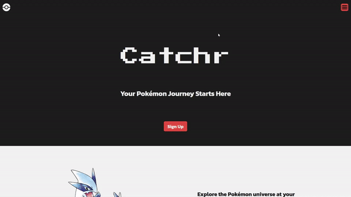
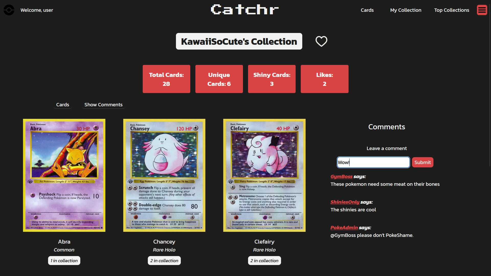
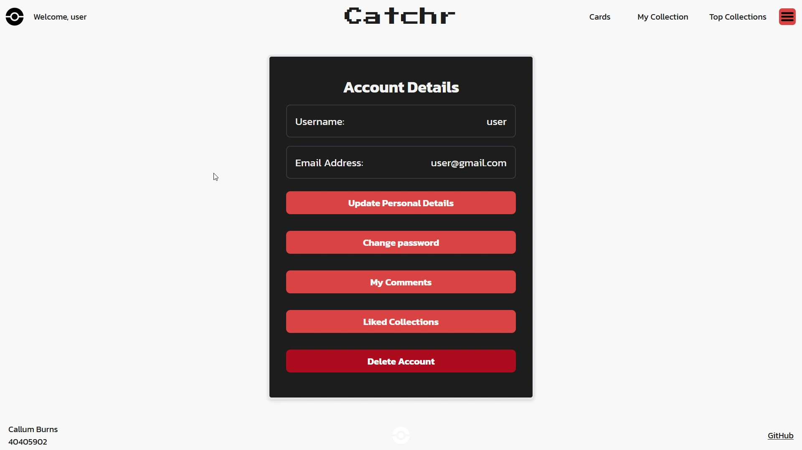

# [Catchr](https://github.com/niccybuzz/Catchr)

Catchr is a web application designed for trading card enthusiasts, specifically focusing on Pokémon cards. The app allows users to explore a comprehensive catalogue of cards, create and manage personalized collections, and interact with other users.

## Features

- Comprehensive Pokémon Card Catalogue: Search and filter through hundreds of Pokémon cards.
- Personalized Collections: Create and manage custom collections, add cards, and track your personal inventory.
- User Authentication: Secure user login and registration system using JSON Web Tokens (JWT).
- CRUD Operations: Fully functional Create, Read, Update, Delete operations for card collections, managed via Sequelize ORM.
- Responsive UI: Built with modern UX principles for a smooth and engaging experience across devices.

## Tech Stack

- Frontend: JavaScript, HTML, CSS, EJS
- Backend: Node.js, Express
- Database: MySQL, Sequelize ORM
- Authentication: JWT-based user authentication
- API: Express
- Data Encryption: Secure handling of user data using bcrypt

## Setup Instructions

**Clone the repository:**

    git clone https://github.com/niccybuzz/Catchr.git

    cd catchr

**Install API dependencies and run:**

    cd catchrApi
    npm install
    npx nodemon

**Install main app dependencies and run:**

    cd ..
    cd catchrApp
    npm install
    npx nodemon

**Open in browser**

    http://localhost:3000

## API Documentation

Full documentation is available under /docs

## Contributing

This is a personal university project. Contributions are not currently permitted.

## License

This project is licensed under the MIT License.
